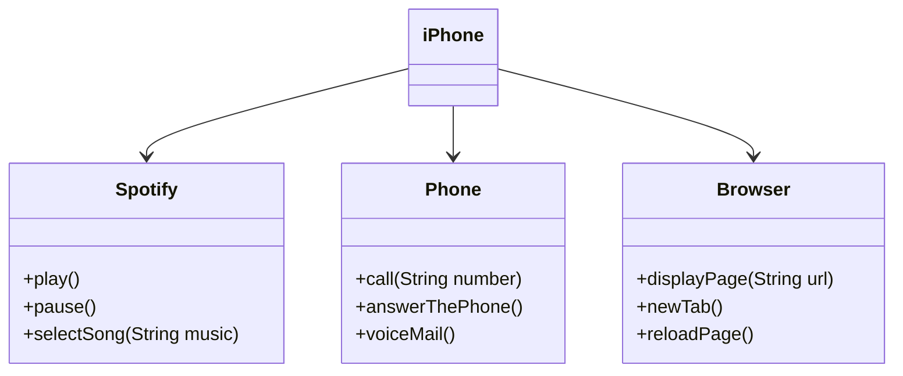

## Modeling iPhone Functions

 

This repository is a challenge proposed by [DIO](https://www.dio.me/en) (Digital Innovation One) - **"Formação Claro - Java com Spring Boot"**.

### Challenge proposal 📝
In this challenge the proposal was to apply business analysis concepts and object-oriented programming requirements and UML modeling to build the model of classes and interfaces in order to simulate the features of the first iPhone: Music Player, Telephone Calls and Internet Browser.

### My UML diagram representation 📈

> [!NOTE]
> The diagram model above was built with the tools available on the [Mermaid](https://mermaid.js.org/) website.

### Contributing 🤝
Did you find any syntax errors or other problems? No problem! Open an Issue in the repository or make a fork, leaving the commits with descriptive messages and send the pull request!
